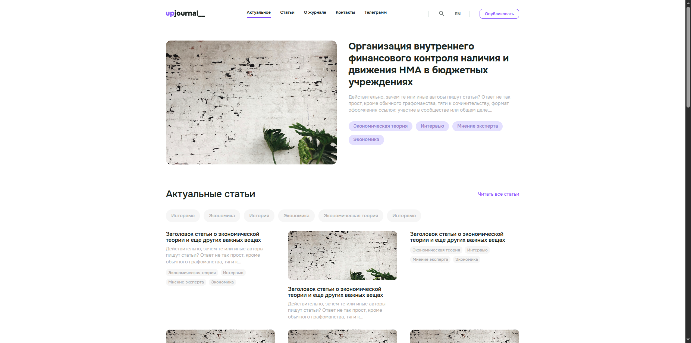

# 📰 UpJournal — Magazine

Project on layout and frontend development of the website of an online magazine.  
Built with **Gulp**, supports automated build, optimization, and live-reload.

---

## ✨ Preview

### Desktop version


### Mobile version


Live demo available at:  
👉 [https://makaksel.github.io/UpJournal/](https://makaksel.github.io/UpJournal/)

---

## 🛠 Technologies
- **HTML5**, **CSS3 (SCSS)**, **JavaScript (ES6)**
- **Gulp** — task runner
- **Flexbox / Grid** for layout
- **GitHub Pages** for deployment

---

## ⚡ Installation & Usage
Clone the repository:
```bash
git clone https://github.com/makaksel/UpJournal.git
cd UpJournal
```

Install dependencies:
```bash
npm install
```

Run development server:
```bash
npm run dev
```

Build the project:
```bash
npm run build
```

***


# 📰 UpJournal — журнал

Проект по вёрстке и фронтенд-разработке сайта онлайн-журнала.  
Собран с помощью **Gulp**, поддерживает автоматическую сборку, оптимизацию и live-reload.

---

## ✨ Превью

### Десктопная версия


### Мобильная версия


Онлайн-версия доступна по ссылке:  
👉 [https://makaksel.github.io/UpJournal/](https://makaksel.github.io/UpJournal/)

---

## 🛠 Технологии
- **HTML5**, **CSS3 (SCSS)**, **JavaScript (ES6)**
- **Gulp** — сборщик проекта
- **Flexbox / Grid** для вёрстки
- **GitHub Pages** для публикации

---

## ⚡ Установка и запуск
Склонировать репозиторий:
```bash
git clone https://github.com/makaksel/UpJournal.git
cd UpJournal
```

Установить зависимости:
```bash
npm install
```

Запустить режим разработки:
```bash
npm run dev
```

Запустить билд:
```bash
npm run build
```